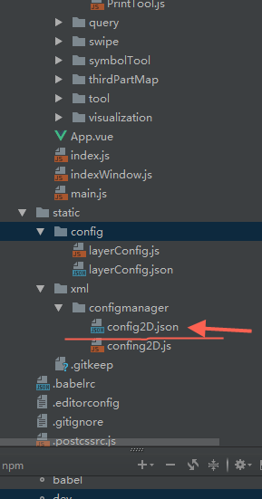

# 图层加载工具ConfigLoadTool


在得到gismap3的图层描述文件是要存到一个config2D.json中，json 数据格式如下

```json


{
  "LAYERS": {
    "LAYER": [
      {
        "SERVICES_ADDR": "http://61.144.226.44:6080/arcgis/rest/services/msmap/BOOKS/MapServer/0",
        "LAYERID": "0",
        "DISPLAYLAYERNAME": "行政区",
        "MAPSERVICES": "http://61.144.226.44:6080/arcgis/rest/services/msmap/BOOKS/MapServer",
        "LAYER_TYPE": "ArcGISDynamicMapServiceLayer",
        "MOUSEMOVE_FIELD": {
          "FIELD": [
            {
              "FIELD_CNAME": "OBJECTID",
              "FIELD_ENAME": "OBJECTID"
            },
            {
              "FIELD_CNAME": "NAME",
              "FIELD_ENAME": "NAME"
            },
            {
              "FIELD_CNAME": "AREA",
              "FIELD_ENAME": "SDE.SZ_ADMIN_ZONE.AREA"
            },
            {
              "FIELD_CNAME": "LEN",
              "FIELD_ENAME": "SDE.SZ_ADMIN_ZONE.LEN"
            },
            {
              "FIELD_CNAME": "SHAPE.AREA",
              "FIELD_ENAME": "SHAPE.AREA"
            },
            {
              "FIELD_CNAME": "SHAPE.LEN",
              "FIELD_ENAME": "SHAPE.LEN"
            }
          ]
        },
        "SELDEFINE": {
          "PROPERTY": [
            {
              "PROPER_DESCRIPTION": "权限值",
              "PROPER_KEY": "priority",
              "PROPER_VALUE": "5"
            },
            {
              "PROPER_DESCRIPTION": "点击查询",
              "PROPER_KEY": "clickFlag",
              "PROPER_VALUE": "1"
            },
            {
              "PROPER_DESCRIPTION": "移动查询",
              "PROPER_KEY": "queryFlag",
              "PROPER_VALUE": "0"
            },
            {
              "PROPER_DESCRIPTION": "透明度",
              "PROPER_KEY": "alpha",
              "PROPER_VALUE": "0.5"
            }
          ]
        }
      },
       {
              "SERVICES_ADDR": "http://61.144.226.44:6080/arcgis/rest/services/msmap/BOOKS/MapServer/1",
              "LAYERID": "1",
              "DISPLAYLAYERNAME": "深圳市规划选址意见书",
              "MAPSERVICES": "http://61.144.226.44:6080/arcgis/rest/services/msmap/BOOKS/MapServer",
              "LAYER_TYPE": "ArcGISDynamicMapServiceLayer",
              "MOUSEMOVE_FIELD": {
                "FIELD": [
                  {
                    "FIELD_CNAME": "OBJECTID",
                    "FIELD_ENAME": "OBJECTID"
                  },
                  {
                    "FIELD_CNAME": "LICENSE_NO",
                    "FIELD_ENAME": "LICENSE_NO"
                  },
                  {
                    "FIELD_CNAME": "PROJ_NAME",
                    "FIELD_ENAME": "PROJ_NAME"
                  },
                  {
                    "FIELD_CNAME": "SHAPE.AREA",
                    "FIELD_ENAME": "SHAPE.AREA"
                  },
                  {
                    "FIELD_CNAME": "SHAPE.LEN",
                    "FIELD_ENAME": "SHAPE.LEN"
                  }
                ]
              },
              "SELDEFINE": {
                "PROPERTY": [
                  {
                    "PROPER_DESCRIPTION": "权限值",
                    "PROPER_KEY": "priority",
                    "PROPER_VALUE": "5"
                  },
                  {
                    "PROPER_DESCRIPTION": "点击查询",
                    "PROPER_KEY": "clickFlag",
                    "PROPER_VALUE": "1"
                  },
                  {
                    "PROPER_DESCRIPTION": "移动查询",
                    "PROPER_KEY": "queryFlag",
                    "PROPER_VALUE": "0"
                  },
                  {
                    "PROPER_DESCRIPTION": "透明度",
                    "PROPER_KEY": "alpha",
                    "PROPER_VALUE": "0.5"
                  }
                ]
              }
            }
      
         ]
       }
     }
 

```

所有的图层放到LAYER的数组中
- config2D.json文件默认存在index.html 同级目录的 **./static/xml/configmanager/config2D.json**



- 因为configLoadTool使用axios，在IE 下最好安装babel-polyfill
- 启动加载json 文件
```javascript

   import {configLoadTool} from "gismap3";

   configLoadTool.load();


```

如果需要自定义json路径可以设置

```javascript

   import {configLoadTool} from "gismap3";

   //这里设置自定义的路径json路径
   configLoadTool.layer2DPath = "";


```

以后的例子按照以下的服务url来测试，可以把这些图层用自动化工具注册好，按规范存好

```shell

业务图层 ArcGISDynamicMapServiceLayer(深圳坐标系)

http://61.144.226.44:6080/arcgis/rest/services/msmap/BOOKS/MapServer

深圳市地图底图ArcGISTiledMapServiceLayer (深圳坐标系)

http://121.201.65.133:2001/arcgis/rest/services/szmap_10_170117/MapServer

深圳市2015遥感影像ArcGISTiledMapServiceLayer (深圳坐标系)
http://61.144.226.44:6080/arcgis/rest/services/image/wpjc_image_201506_01/MapServer
深圳市2014遥感影像ArcGISTiledMapServiceLayer (深圳坐标系)
http://61.144.226.44:6080/arcgis/rest/services/image/WVQB_image_201406_01/MapServer
深圳市2011遥感影像ArcGISTiledMapServiceLayer (深圳坐标系)
http://61.144.226.44:6080/arcgis/rest/services/image/AVI_image_201111_01/MapServer


```

