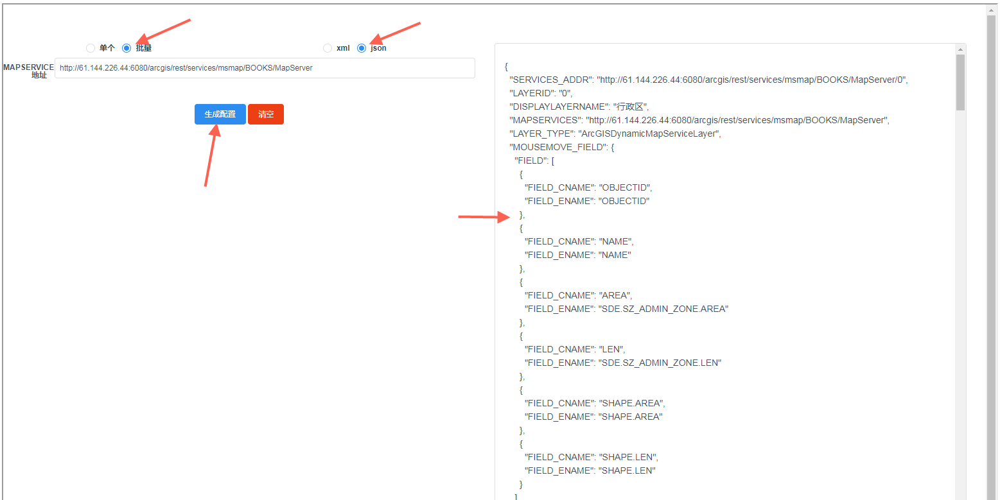
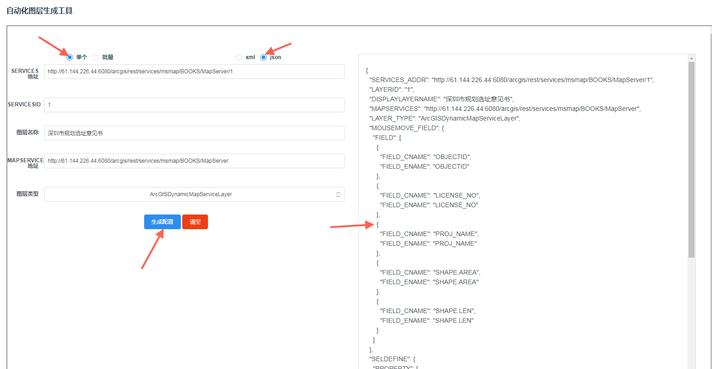
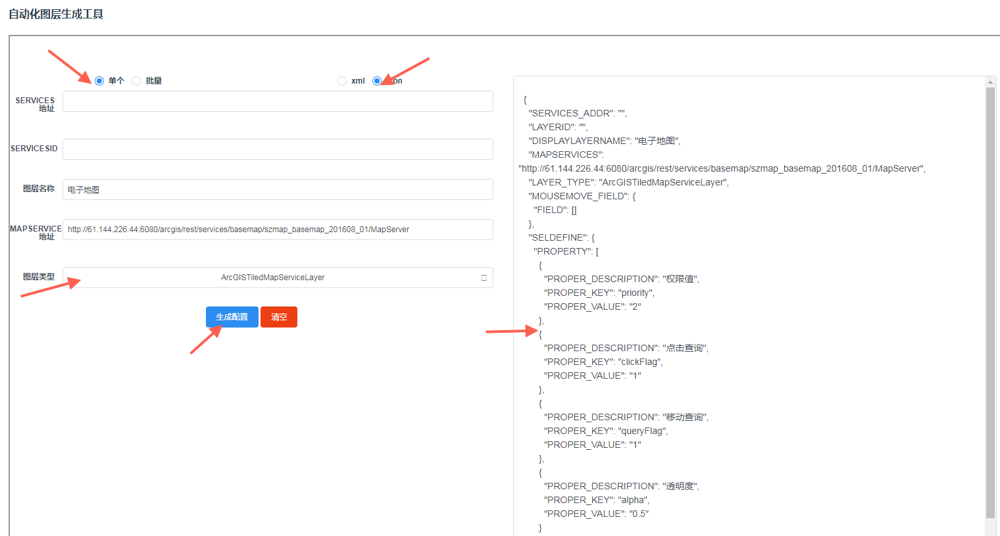
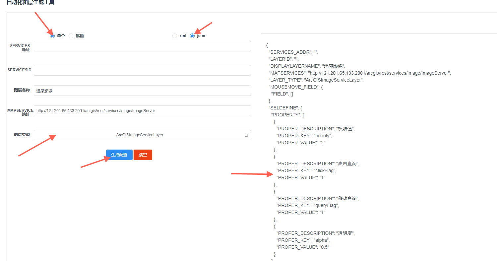

# 自动化图层生成工具

   <iframe style="width:100%;height:800px" src="../../static/tools/index.html"></iframe>

  

- ArcGISDynamicMapServiceLayer

1. 加载批量图层 输入地址 http://61.144.226.44:6080/arcgis/rest/services/msmap/BOOKS/MapServer
会生成该图层下的所有图层组

2.单个图层 输入地址 http://61.144.226.44:6080/arcgis/rest/services/msmap/BOOKS/MapServer/1
会生成该图层

- ArcGISTiledMapServiceLayer

加载图层 http://61.144.226.44:6080/arcgis/rest/services/basemap/szmap_basemap_201608_01/MapServer

- ArcGISImageServiceLayer

加载图层 http://121.201.65.133:2001/arcgis/rest/services/image/ImageServer

