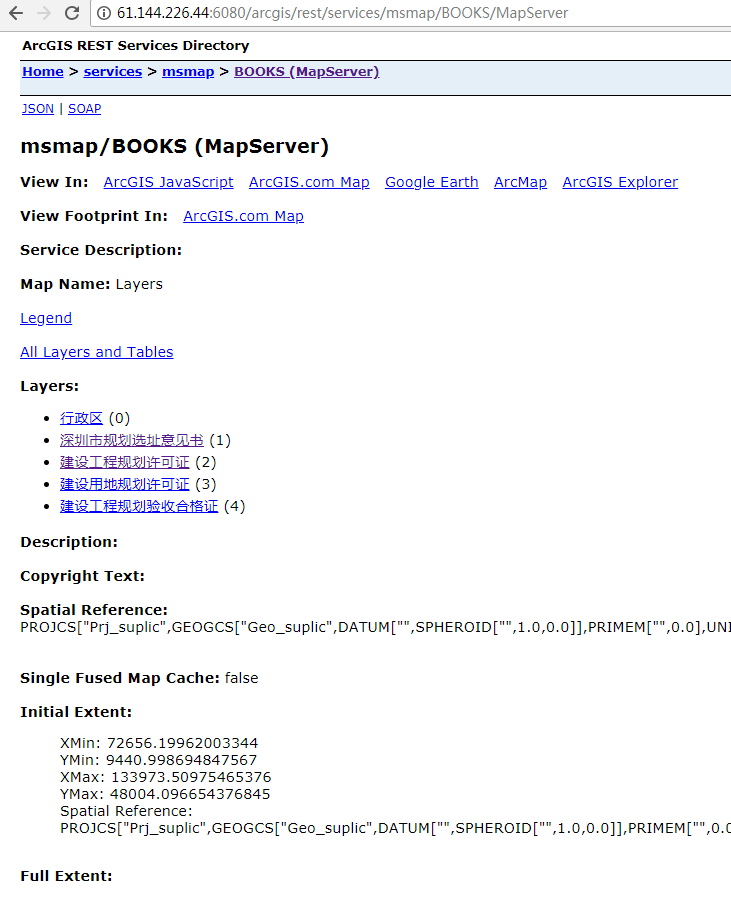
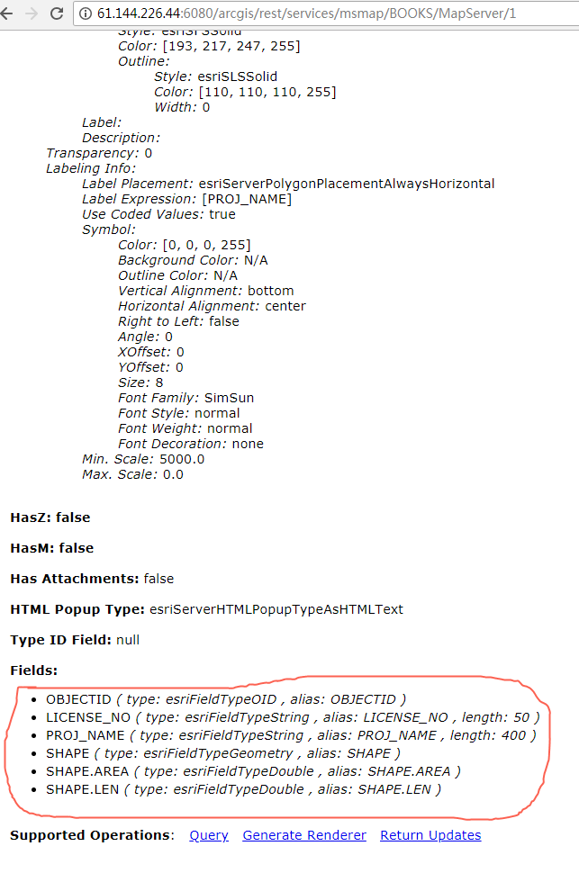
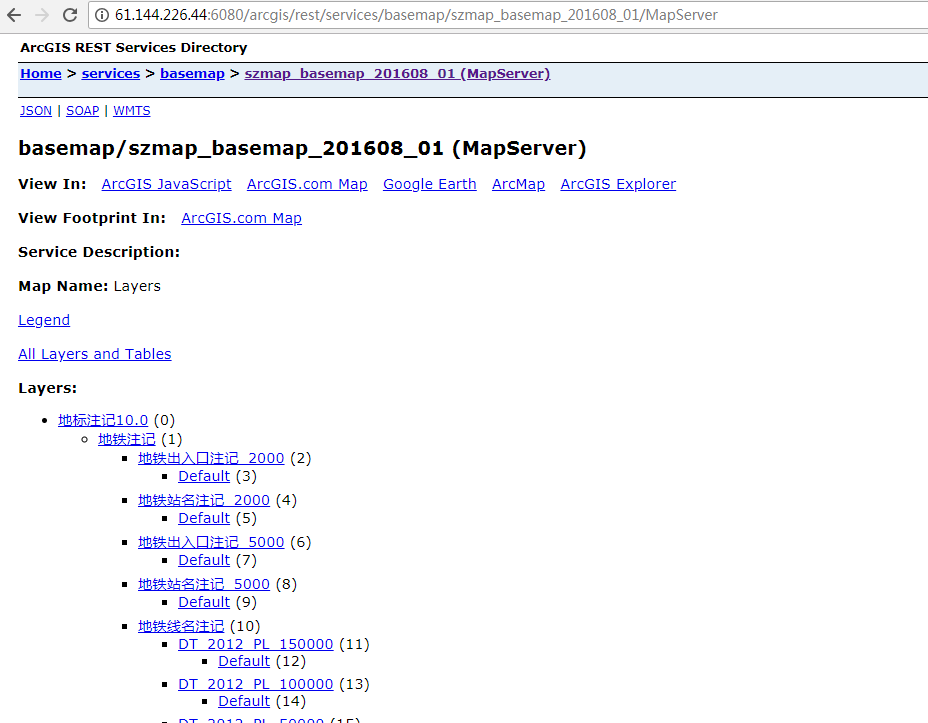
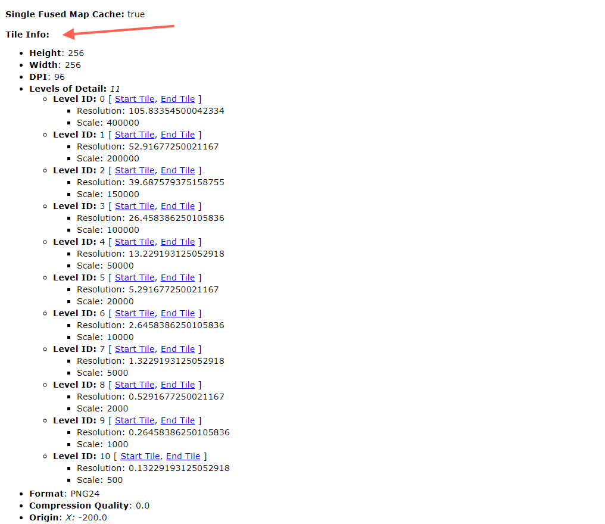

# arcgis图层数据结构

arcgis 有很多layer 这边的图层描述文件暂时支持 ArcGISDynamicMapServiceLayer
ArcGISTiledMapServiceLayer ArcGISImageServiceLayer

- ArcGISDynamicMapServiceLayer

ArcGISDynamicMapServiceLayer 是矢量图层在浏览器打开 **http://61.144.226.44:6080/arcgis/rest/services/msmap/BOOKS/MapServer**会看到

这个代表的是ArcGISDynamicMapServiceLayer，注意他是以MapServer结尾，并且没有Tile Info:
信息 以下的行政区，深圳市规划选址意见书就是一个个图层，点击深圳市选址意见书进去

 
红线框起来就是该图层的字段描述类似于数据库的字段 下面有个Query 链接，arcgis发布的rest服务支持查询

-  ArcGISTiledMapServiceLayer

ArcGISTiledMapServiceLayer 是切片图层浏览器打开 **http://61.144.226.44:6080/arcgis/rest/services/basemap/szmap_basemap_201608_01/MapServer**

ArcGISTiledMapServiceLayer 不管里面有多少节点 都可以把整个地址当成一个图层，其中ArcGISTiledMapServiceLayer必定有
Tile Info:信息。

-  ArcGISImageServiceLayer

ArcGISImageServiceLayer 是对于 tiff img 等 栅栏数据 发布的图层 
浏览器打开 **http://121.201.65.133:2001/arcgis/rest/services/image/ImageServer**
其中注意是ImageServer 结尾

|图层类型  | 是否切片  | 是否包含图层组  |描述  |
|---|-----:|:----:|:----:|
|  ArcGISDynamicMapServiceLayer     |    否  |    有图层组      |  arcgis server 发布的矢量图层     |
|  ArcGISTiledMapServiceLayer    |   是  |    整个地址就是一个图层     |   arcgis server 发布的切片图层     |
|  ArcGISImageServiceLayer     |     看发布的选择   |   整个地址就是一个图层      |  arcgis server 基于栅栏数据发布的image图层    |

