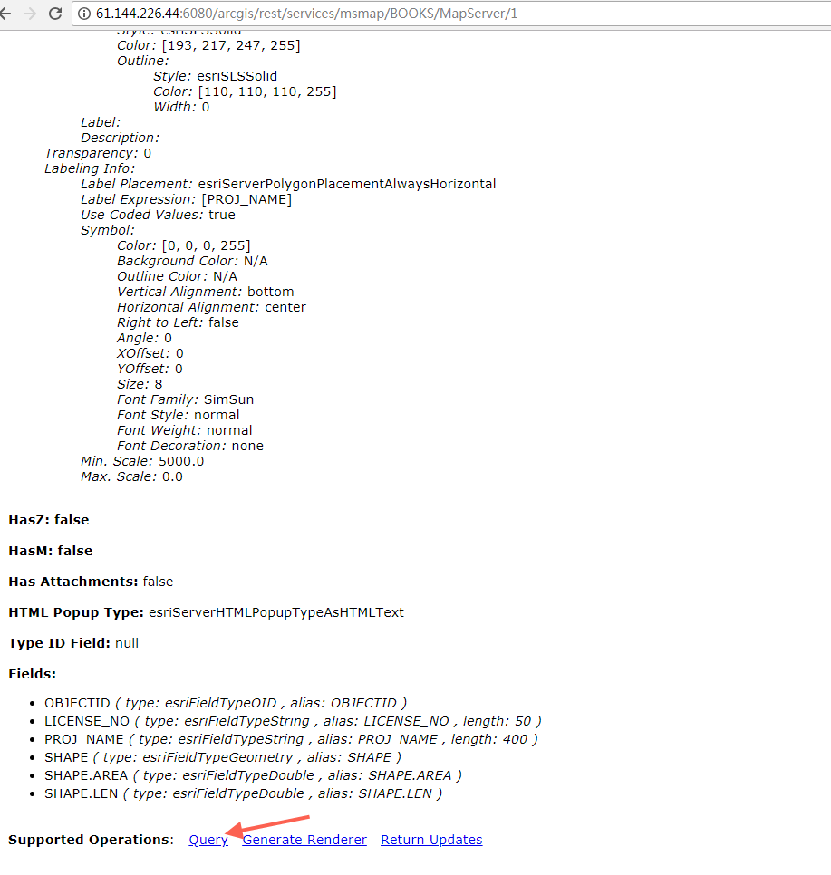
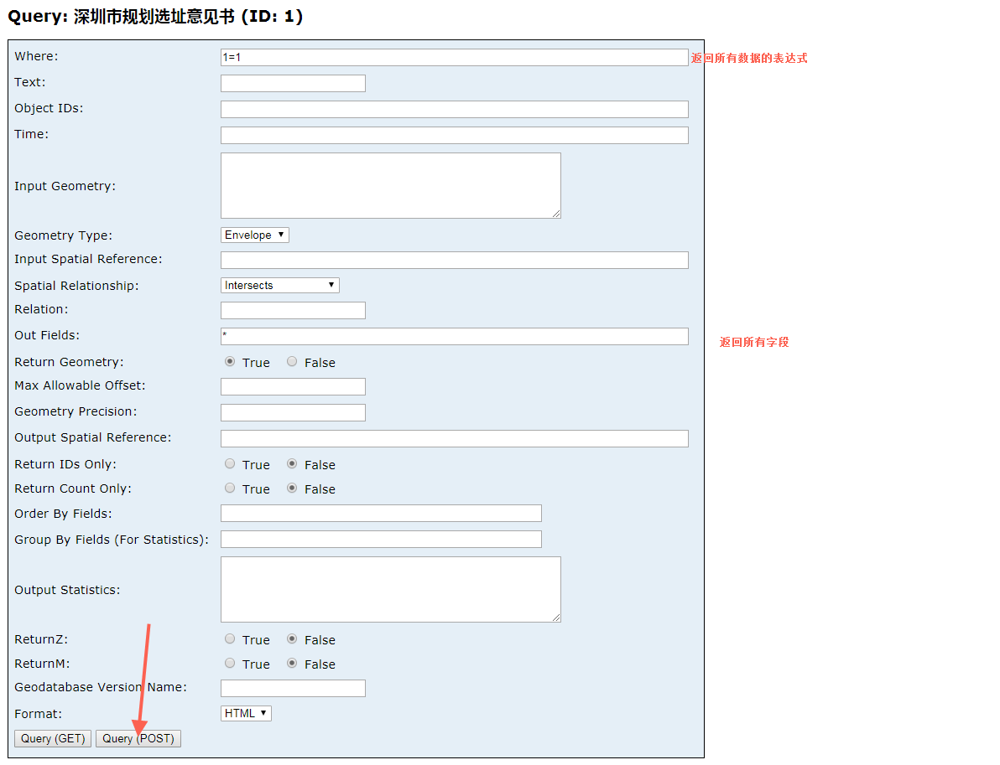
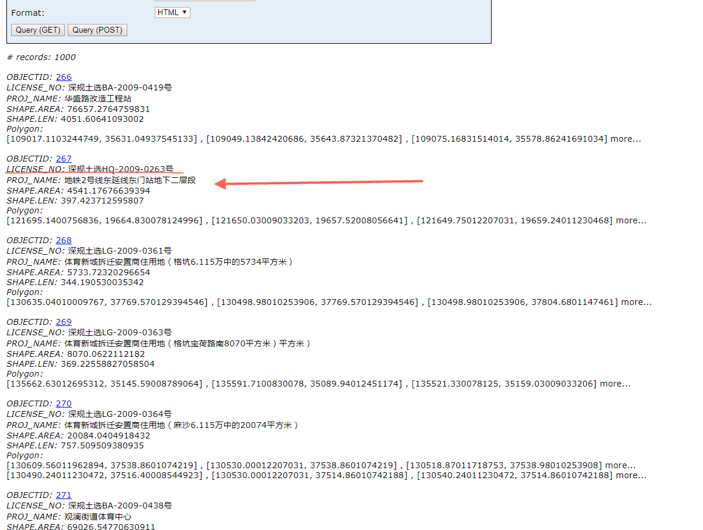
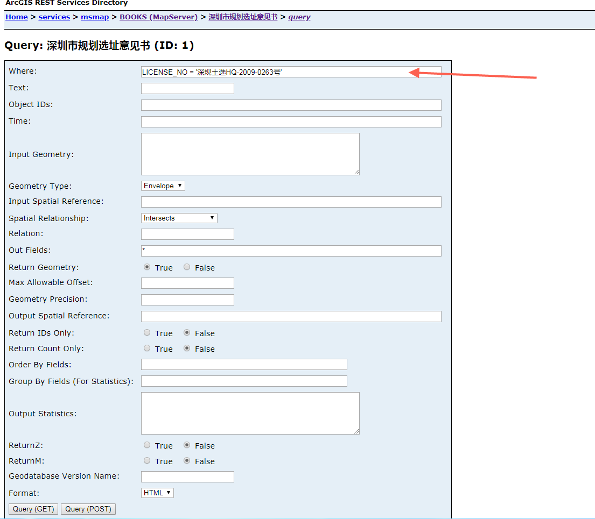
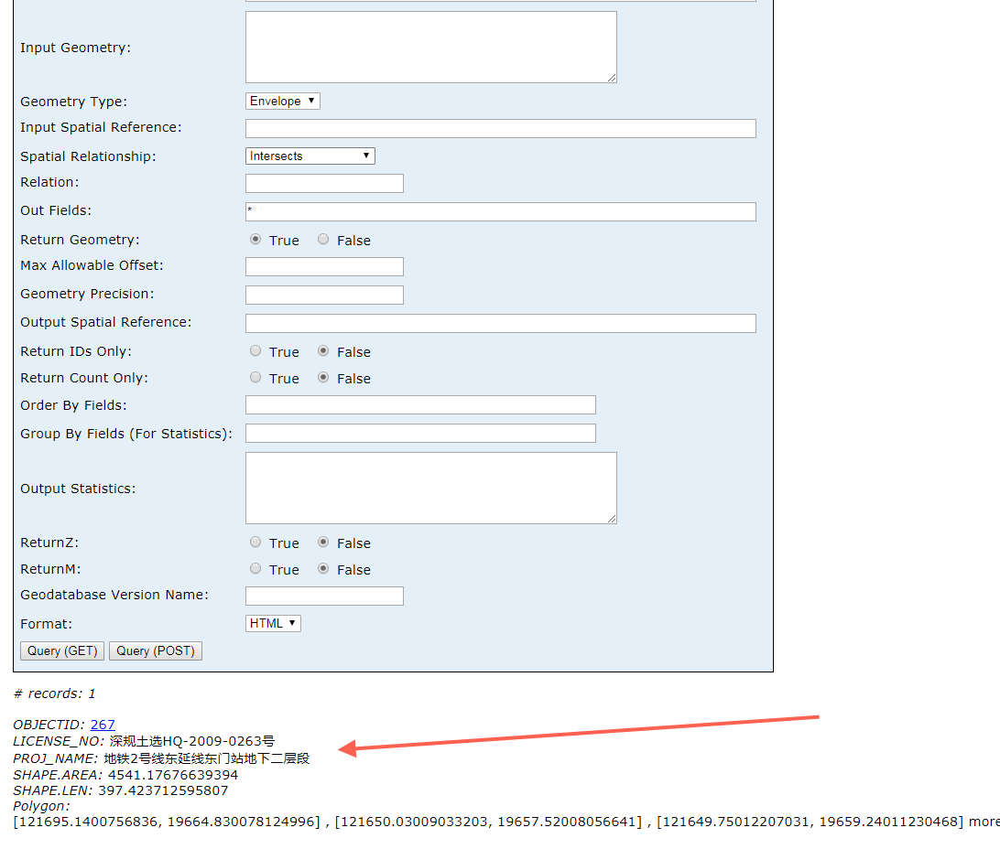
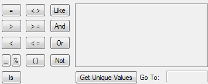

# locateManagerCtrl 定位类


还是以http://61.144.226.44:6080/arcgis/rest/services/msmap/BOOKS/MapServer/1为例子，这个是深圳市规划选址意见书

1.首先先脱离gismap3 打开这个地址



2. 点击query



3. 返回了1000的结构，我们选取某个结果再做查询



4. 输入某个结果的字段表达式




5. 结果




从这个结果可以知道图层的查询可以基于基本sql的表达式目前基于表达式是




下面用gismap3的locateManagerCtrl 来看怎么用这个结果方式


   <baseMap :mapId="mapId" :initExtent="extent"  :layerType="layerType"  :mapType="mapType"  :mapHeight="mapHeight"  :mapWidth="mapWidth" :url="url"></baseMap>
   <el-button  @click="locate" type="primary">zoomByExpresstion定位</el-button>
   <el-button  @click="locate1" type="primary">只定位不带样式</el-button>
   <el-button  @click="locate2" type="primary">只查询不定位</el-button>
::: demo

```html
<template>
<div>
     <baseMap :mapId="mapId" :initExtent="extent"  :layerType="layerType"  :mapType="mapType"  :mapHeight="mapHeight"  :mapWidth="mapWidth" :url="url"></baseMap>
     <el-button  @click="locate" type="primary">zoomByExpresstion定位</el-button>
  </div>
</template>
<script>

  
    import {configLoadTool} from  "gismap3";
    import {locateManagerCtrl}  from  "gismap3";
    
  export default {
      
      
       components:{
           
          },
        data() {
            return {
                
               mapId:'5555',  
               mapHeight:'500px',
               mapWidth:'1000px',
               mapType:"tiled",
               layerType:"",
               url:"http://121.201.65.133:2001/arcgis/rest/services/szmap_10_170117/MapServer",
               extent:{                      
                          
                    xmax:106845.70780098543,
                    ymax:54047.27319746484,
                    xmin:87001.91811340605,
                    ymin:18751.785939823654
                                    
                 },
               
        
            }
        },
        methods:{
          locate(){
              
             locateManagerCtrl.zoomByExpresstion(this.mapId,"深圳市规划选址意见书","LICENSE_NO = '深规土选HQ-2009-0263号'")
          },
           locate1(){
                        
               locateManagerCtrl.zoomByExpresstion(this.mapId,"深圳市规划选址意见书","LICENSE_NO = '深规土选HQ-2009-0263号'",null).then((r) => {
                  
                  
                   //这里可以自己定义样式
                   
               })
                    
          },
         locate2(){
                      
              locateManagerCtrl.queryGraphics(this.mapId,"深圳市规划选址意见书","LICENSE_NO = '深规土选HQ-2009-0263号'").then((r) => {
                   
                   console.log("查询结果集",r)
              })
                  
           }
           
        },
        mounted(){
           
            configLoadTool.load("json");
        }
    }
</script>
```
:::


**locateManagerCtrl** 方法

|名称  |参数  | 参数类型参数描述  |描述  |
|---|-----:|:----:|:----:|
|  zoomByExpresstion     |   (mapId,layerName,expresstion,symbol = '')    |  (string,string,string,Symbol) (地图id，数据结构的DISPLAYLAYERNAME，查询表达式，arcgis的Symbol)      | 根据图层名，图层表达式定位图层 回调返回查询结果promise |
|  zoomByGraphic    |   (mapId,layerName,graphic,symbol = '')   | (string,string,Graphic,Symbol) (地图id，自定义名称，arcigs 的Graphic，arcgis的Symbol)     |    根据arcgis已存在的graphic 定位  |
|  zoomByXY    |   (mapId,layerName,x,y,symbol = '')  | (string,string,Number,Number,Symbol)     (地图id，图层，arcigs 的Graphic，arcgis的Symbol)     |     根据x,y 定位一个点   |
|  queryGraphics    |   (mapId,layerName,expresstion,geometry)|  (string,string,string,Geometry) (地图id，数据结构的DISPLAYLAYERNAME，查询表达式,arcgis的geometry)    |   根据表达式或者图形叠加查询某个图层 回调返回查询结果promise |
|  findTask    |  (url, layerIds, searchFields, searchText)  | (string,Array,Array,string)       |    根封装了arcgis的 findTask 回调返回查询结果promise |
|  identifyTask    |  (mapId, url, layerIds, geometry) | (string,string,Array,Geometry)     |   封装了arcgis的identifyTask 回调返回查询结果promise |
